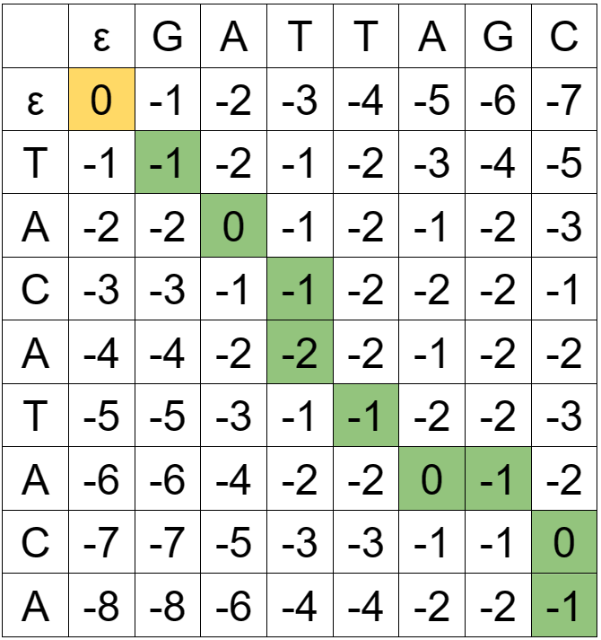

# Data Structures and Algorithms 2

**Github repository**: <https://github.com/alialsawad/DSA_2_Submission>

**Package constraints**: NumPy, Matplotlib, Pandas and NetworkX.

## **1. N-Queens Problem**

Code the n-queens problem in Python with the following instructions:

**Requirements**:

1. Ask the user how many queens do they want to place.
2. Ask the user what approach they want to use (Backtracking or Las Vegas).
3. Give a result with the positions of the queens.
4. Give a visualization in a chessboard-like way where all the queens are placed in their respective positions.

```python
import numpy as np
import random
import matplotlib.pyplot as plt


class NQueens:

    def __init__(self, n):
        self.n = n
        self.reset()

    def reset(self):
        self.board = np.zeros((self.n, self.n), dtype=int)
        self.col = set()
        self.diag = set()
        self.anti_diag = set()

    def is_safe(self, r, c):
        return not (c in self.col or
                    (r + c) in self.diag or
                    (r - c) in self.anti_diag)

    def place_queen(self, r, c):
        self.col.add(c)
        self.diag.add(r + c)
        self.anti_diag.add(r - c)
        self.board[r, c] = 1

    def remove_queen(self, r, c):
        self.col.remove(c)
        self.diag.remove(r + c)
        self.anti_diag.remove(r - c)
        self.board[r, c] = 0

    def backtrack(self, r=0):
        if r == self.n:
            return self.board

        for c in range(self.n):
            if self.is_safe(r, c):
                self.place_queen(r, c)

                res = self.backtrack(r + 1)
                if not res is None:
                    return res

                self.remove_queen(r, c)

        return None

    def las_vegas_n_queens(self, limit=10):
        total_runs = 0

        while total_runs < limit:
            total_runs += 1

            for r in range(self.n):
                available_cols = [c for c in range(
                    self.n) if self.is_safe(r, c)]
                if len(available_cols) == 0:
                    self.reset()
                    break
                self.place_queen(r, random.choice(available_cols))
            else:
                return self.board

        return None

    def solve(self, method):
        if method == "b":
            self.board = self.backtrack()
        elif method == "l":
            self.board = self.las_vegas_n_queens()

        return self.board

    def draw_board(self):
        if self.board is None:
            print("No solution found")
            return

        _, ax = plt.subplots()
        text_size = max(10, 250 // self.n)

        for (i, j), value in np.ndenumerate(self.board):
            color = '#EEEED2' if (i + j) % 2 == 0 else '#769656'
            rect = plt.Rectangle([j, i], 1, 1, facecolor=color)
            ax.add_patch(rect)

            if value == 1:
                plt.text(j + 0.5, i + 0.5, '♛', size=text_size, color='black',
                         ha='center', va='center')

        plt.xlim(0, self.n)
        plt.ylim(0, self.n)
        plt.show()

    def test_eight_queens_las_vegas(self, runs=10000):
        self.n = 8
        self.reset()
        success = sum(
            [1 for _ in range(runs) if not self.las_vegas_n_queens() is None])

        print(f"Success rate: {success/runs}")


n = int(input("""
Enter n:
- n represents the number of queens and the size of the n x n board.
"""))

method = input("""
Enter the solution method (b/l):
- b: Backtracking.
- l: Las Vegas
""").lower()

board = None
n_queens = NQueens(n)

if method == "b" or method == "l":
    board = n_queens.solve(method)
    print("Board:", board)
    n_queens.draw_board()
else:
    print("Invalid solution method")

n_queens.test_eight_queens_las_vegas()
```

### What are the differences between the two algorithms?

- The main difference between the two algorithms is how they respond to encountering dead ends. The backtracking approach undoes its steps and returns to an earlier decision point to explore different configurations. In contrast, the Las Vegas approach restarts with a completely new board configuration upon reaching a dead end.
- Backtracking is deterministic, meaning it consistently follows the same path and makes the same choices for a given input. In contrast, the Las Vegas approach is non-deterministic; it can follow different paths for the same input.
- The Las Vegas approach exhibits higher variability in time complexity from one run to another, even with the same input, in contrast to the backtracking approach.
- The backtracking approach systematically explores all possible configurations to find a solution if one exists, as it is exhaustive in nature. In contrast, the Las Vegas approach may not always find a solution, especially with a limited number of attempts. However, if allowed to run indefinitely and assuming a solution exists, the Las Vegas algorithm would eventually find a solution.

### Which data structure/s did you use to implement this problem? Give your reasoning.

- I utilized a 2D array to represent the board. This proved efficient given the constant time access provided by the array data structure and the frequency of accesses our algorithms need. The 2D array also simplifies both initialization and traversal processes. Additionally, traversing the array simplifies the extraction of the queens' arrangement on the board, which aids in visualization.

- To track the positions under attack by the queens, I employed three sets:

  - `col` monitors the columns that are under attack.
  - `diag` keeps track of the diagonals under attack.
  - `anti_diag` identifies the anti-diagonals that are under attack.

Using sets allows for constant time insertion, removal and checking whether an element with the specified value exists in the set or not.

### If we have 8 queens, what is the success rate of each of the algorithms?

**Hint:** To know the success rate, decide on a fixed number of runs. From these, record which runs give a successful result. By dividing the successful runs over the total amount of runs, you’ll have the success rate of your algorithm.

- The success rate of the Las Vegas approach for the eight queens problem is approximately 0.72 given 10 attempts each run. The backtracking approach is guaranteed to find a solution if one exists, so its success rate is 1.0.

## **2. Minimum Spanning Tree**

Using Python programming language, code one of the Minimum Spanning Tree (MST) algorithms, either Prim’s or Kruskal’s, for the following graph:


**Requirements:**

1. Depict the original graph first.
2. State which MST algorithm you are following.
3. Show the creation of the MST step by step.
4. Depict the final MST

```python
from math import ceil
import networkx as nx
import matplotlib.pyplot as plt
from heapq import heappush, heappop


class PrimsAlgorithm:

    def __init__(self, G):
        self.graph = G

    def run(self, starting_node):
        print(
            f"Starting Prim's Algorithm on the following graph:\n{G.edges(data=True)}")

        visited = set()
        min_heap = [(0, None, starting_node)]
        mst_edges = []
        total_weight = 0

        while len(visited) < len(G):
            w, u_prev, u = heappop(min_heap)

            if u in visited:
                continue

            if u_prev is not None:
                mst_edges.append((u_prev, u, w))

            visited.add(u)
            total_weight += w

            for v, data in G[u].items():
                if v not in visited:
                    heappush(min_heap, (data['weight'], u, v))

        print(f"Minimum Spanning Tree Edges: {mst_edges}")
        print(f"Total Weight: {total_weight}")
        return mst_edges, total_weight


class MstVisualizer:

    def __init__(self, G, mst_edges, total_weight, layout=None):
        self.graph = G
        self.mst_edges = mst_edges
        self.total_weight = total_weight
        self.pos = nx.shell_layout(G) if layout is None else layout

    def draw_graph(self):
        # +1 for original graph, +1 for mst
        num_steps = len(self.mst_edges) + 2
        num_cols = 3
        num_rows = ceil(num_steps / num_cols)

        # Create a figure with a subplot for each step of the algorithm
        _, axes = plt.subplots(nrows=num_rows, ncols=num_cols,
                               figsize=(20, 5))
        axes = axes.flatten()


        # A list of highlighted edges as they were added to the MST
        cur_mst_edges = set()
        for i in range(num_steps):
            if i > 0 and i <= len(self.mst_edges):
                cur_mst_edge = self.mst_edges[i - 1]
                cur_mst_edges.add((cur_mst_edge[0], cur_mst_edge[1]))
            # Draw the current graph representation at the corresponding axis
            self._draw_graph_step(axes[i], i, cur_mst_edges)

        # remove extra axes (subplots) that we don't need
        for i in range(num_steps, len(axes)):
            axes[i].axis('off')
        plt.tight_layout()
        plt.show()

    def _draw_graph_step(self, ax, step, cur_mst_edges):
        not_mst = step <= len(self.mst_edges)

        graph_title = ""
        if not_mst:
            graph_title = "Original Graph" if step == 0 else f"Step {step}: Adding Edge {self.mst_edges[step - 1]}"
        else:
            graph_title = f"Minimum Spanning Tree. Total Weight: {self.total_weight}"

        edge_labels = nx.get_edge_attributes(self.graph, 'weight') if not_mst else {
            (edge[0], edge[1]): edge[2] for edge in self.mst_edges}

        graph_info = {
            "mst_edges": cur_mst_edges,
            "edge_labels": edge_labels,
            "title": graph_title,
        }
        if not_mst:
            # Draw both the edges of the original graph and the edges of the MST
            graph_info["edges"] = self.graph.edges

        self._draw_graph_info(ax, graph_info)

    def _draw_graph_info(self, ax, graph_info):
        mst_edges = graph_info.get("mst_edges", [])
        # Remove duplicate edges so that we don't draw them twice (better visualization)
        graph_edges = list(filter(
            lambda edge: edge not in mst_edges and
            (edge[1], edge[0]) not in mst_edges, graph_info.get("edges", [])))

        all_edges = list(graph_edges) + list(mst_edges)

        edge_colors = ['black'] * len(graph_edges) + ['red'] * len(mst_edges)

        nx.draw_networkx(self.graph, self.pos, ax=ax, node_color='lightblue',
                         node_size=600, edgelist=all_edges, edge_color=edge_colors, width=1.25)
        nx.draw_networkx_edge_labels(
            self.graph, self.pos, edge_labels=graph_info.get("edge_labels"), ax=ax, font_size=8)
        ax.set_title(
            graph_info.get("title"), fontsize=12)


def create_graph(edges):
    G = nx.Graph()
    G.add_weighted_edges_from(edges)
    return G


edges = [("A", "C", 16), ("A", "B", 4), ("A", "D", 3), ("A", "E", 1),
         ("E", "D", 1), ("C", "B", 5), ("C", "F", 5), ("B", "F", 9),
         ("B", "D", 8), ("D", "F", 12), ("F", "Z", 1)]

G = create_graph(edges)

prims_algorithm = PrimsAlgorithm(G)
mst_edges, total_weight = prims_algorithm.run(starting_node="A")

mst_visualizer = MstVisualizer(G, mst_edges, total_weight)
mst_visualizer.draw_graph()
```

## **3. Quick Sort**

### Provide the pseudocode for an in-place quicksort algorithm where the pivot is always the second element in the array.

```
# Procedure partition:
# Inputs:
# - arr: list of comparable items to be sorted
# - lo: the lower bound of the list
# - hi: the upper bound of the list
procedure partition(arr: List of comparable items, lo: Integer, hi: Integer)

    # Question constraint: pivot is always the second element in the list
    swap(arr, lo, lo + 1)
    pivot := arr[lo]

    i := lo + 1
    j := hi

    # Partitioning step
    while True then
        # Check if arr[i] is less than the pivot and i is within bounds and repeat (while loop)
        while arr[i] < pivot and i < hi
            i := i + 1

        # Check if arr[j] is greater than the pivot and j is within bounds and repeat (while loop)
        while arr[j] > pivot and j > lo
            j := j - 1

        # If pointers have met, break out of the loop
        if i >= j then break

        # Otherwise, swap elements at i and j and increment i and decrement j after the swap
        swap(arr, i, j)
        i := i + 1
        j := j - 1

    # This is after the while loop: the pointers have met and we broke out of the loop
    # Swap the pivot element arr[lo] with arr[j] (its final position in the list)
    swap(arr, lo, j)

    # Return the final pivot index
    return j

# Procedure quickSort:
# Inputs:
# - arr: list of comparable items to be sorted
# - lo: the lower bound of the list
# - hi: the upper bound of the list
procedure quickSort(arr: List of comparable items, lo: Integer, hi: Integer)
    # Base case: if the list has one or zero elements, it's already sorted
    if lo >= hi then return

    partitionIdx := partition(arr, lo, hi) # partition the list and get the final position of the pivot

    # Recursively sort the two partitions
    quickSort(arr, lo, partitionIdx - 1) # sort the left partition
    quickSort(arr, partitionIdx + 1, hi) # sort the right partition

# Procedure sortList:
# Input:
# - arr: list of comparable items to be sorted
# Shuffling the list randomizes pivot selection at the i-th position, guaranteeing O(nlogn) time complexity
procedure sortList(arr: List of comparable items)
    # Shuffle the list for performance guarantee
    shuffle(arr)

    # Sort the list in-place using QuickSort
    quickSort(arr, 0, len(arr) - 1)

    # Return the sorted list
    return arr
```

### Implement that pseudocode using Python.

```python
import random


def swap(arr, i, j):
    """
    Swaps the elements at indices i and j in the list
    """
    arr[i], arr[j] = arr[j], arr[i]


def partition(arr, lo, hi):
    """
    Partitions the list around the pivot and returns the index of the pivot:
        - arr: the list to partition
        - lo: the lower bound of the list
        - hi: the upper bound of the list
    """
    # Question constraint: the pivot is always the second element in the list
    swap(arr, lo, lo + 1)
    pivot = arr[lo]

    i, j = lo + 1, hi

    while True:
        while arr[i] < pivot and i < hi:
            i += 1

        while arr[j] > pivot and j > lo:
            j -= 1

        if i >= j:
            break

        swap(arr, i, j)
        i += 1
        j -= 1

    swap(arr, lo, j)
    return j


def quicksort(arr, lo, hi):
    """
    Sorts the list in-place using quicksort:
        - arr: the list to sort
        - lo: the lower bound of the list
        - hi: the upper bound of the list
    """
    if lo >= hi:
        return

    pivot_idx = partition(arr, lo, hi)
    quicksort(arr, lo, pivot_idx - 1)  # Lower half of the list
    quicksort(arr, pivot_idx + 1, hi)  # Upper half of the list


def shuffle(arr):
    """
    Randomly shuffles the list in-place to guarantee O(nlogn) time complexity regardless of the input
    """
    for i in range(len(arr) - 1, 0, -1):
        j = random.randint(0, i)
        swap(arr, i, j)


def sortArray(arr):
    """
    Sorts a list using quicksort:
        - arr: the list to sort
    Shuffling the list randomizes pivot selection at the i-th position, guaranteeing O(nlogn) time complexity
    """
    shuffle(arr)
    quicksort(arr, 0, len(arr) - 1)

    return arr

print(sortArray([5,2,3,1]))
```

### Is there any other way to code a quicksort algorithm? Cite your sources to answer this question

Yes, there are other ways to code a quicksort algorithm. For example, we can use quicksort three way partitioning method:

```
Partitioning Logic in QuickSort 3 way partitioning [Reference: 1]

a[i] less than v: exchange a[lt] with a[i] and increment both lt and i
a[i] greater than v: exchange a[i] with a[gt] and decrement gt
a[i] equal to v: increment i
```

3-way partitioning makes quicksort asymptotically faster than mergesort and other methods in practical situations involving large numbers of equal keys.[1] Quicksort with 3-way partitioning uses ~ (2ln 2) N H compares to sort N items, where H is the Shannon entropy, defined from the frequencies of key values.[3]

```python
# [Reference: 2]

import random


def swap(arr, i, j):
    """
    Swaps the elements at indices i and j in the list
    """
    arr[i], arr[j] = arr[j], arr[i]


def quicksort_3_way(arr, lo, hi):
    """
    Sorts the list in-place using quicksort:
        - arr: the list to sort
        - lo: the lower bound of the list
        - hi: the upper bound of the list
    """
    if hi <= lo:
        return

    lt, i, gt = lo, lo + 1, hi
    pivot = arr[lo]

    while i <= gt:
        if arr[i] < pivot:
            swap(arr, lt, i)
            lt += 1
            i += 1
        elif arr[i] > pivot:
            swap(arr, i, gt)
            gt -= 1
        else:
            i += 1

    quicksort_3_way(arr, lo, lt - 1)
    quicksort_3_way(arr, gt + 1, hi)


def shuffle(arr):
    """
    Randomly shuffles the list in-place to guarantee O(nlogn) time complexity regardless of the input
    """
    for i in range(len(arr) - 1, 0, -1):
        j = random.randint(0, i)
        swap(arr, i, j)


def sortArray(arr):
    """
    Sorts a list using quicksort:
        - arr: the list to sort
    Shuffling the list randomizes pivot selection at the i-th position, guaranteeing O(nlogn) time complexity
    """
    shuffle(arr)
    quicksort_3_way(arr, 0, len(arr) - 1)

    return arr

print(sortArray([5,2,3,1]))
```

"Another well-known way to find a better partitioning element is to take a sample of three elements from the file, then to use the median of the three for the partitioning element. By choosing the three elements from the left, middle, and right of the array... This improvement is called the median-of-three method. The median-of-three method helps quicksort in three ways. First, it makes the worst case much more unlikely to occur in any actual sort. For the sort to take N^2 time, two out of the three elements examined must be among the largest or among the smallest elements in the file, and this event must happen consistently through most of the partitions. Second, it eliminates the need for a sentinel key for partitioning, because this function is served by one of the three elements that are examined before partitioning. Third, it reduces the total average running time of the algorithm by about 5 percent."[4]

**Sources**:

- [1] Sedgewick, R. and Wayne, K. (2011). Algorithms. 4th ed. Addison-Wesley Professional, p.298.
- [2] Sedgewick, R. and Wayne, K. (2011). Algorithms. 4th ed. Addison-Wesley Professional, p.299.
- [3] Sedgewick, R. and Wayne, K. (2011). Algorithms. 4th ed. Addison-Wesley Professional, p.301.
- [4] Sedgewick, R. (1998). Algorithms In C: Fundamentals, Data Structures, Sorting, Searching, Parts 1-4, 3rd ed. Pearson Education, 7.5 Median-of-Three Partitioning

## **4. Collatz Conjecture**

The Collatz conjecture is a mathematical problem that is unsolved as of yet. Essentially, it states that for any positive integer n, we can arrive to the integer 1 by following the rules:

- 3x + 1 if x is odd
- x/2 if x is even

### Code the Collatz conjecture using Python by creating a recursive function called collatz(n)

```python
def collatz(n):
    if n == 1:
        return True
    elif n % 2 == 0:
        return collatz(n // 2)
    else:
        return collatz(3 * n + 1)

print(collatz(592))
```

## **5. Needleman-Wunsch Algorithm**

Solve the following string alignment problem using Needleman-Wunsch (no coding). You need to use the optimal alignment algorithm with the strings TACATACA and GATTAGC. Please provide the alignment matrix, the trace-back and the string alignment.

```
Needleman-Wunsch scoring system

The variant we will use in this course is the following:

Penalty for a gap: -1 (you might see this as “indel”, insertion/deletion)
Penalty for a mismatch: -1
Score for a match: +1 (coming from the diagonal)
```

### Alignment matrix with traceback



**Note**: The traceback is the path from the bottom right corner to the top left corner of the alignment matrix.

### Aligned strings:

- TACATA-CA
- GA-TTAGC-

**Global alignment score:** -1
